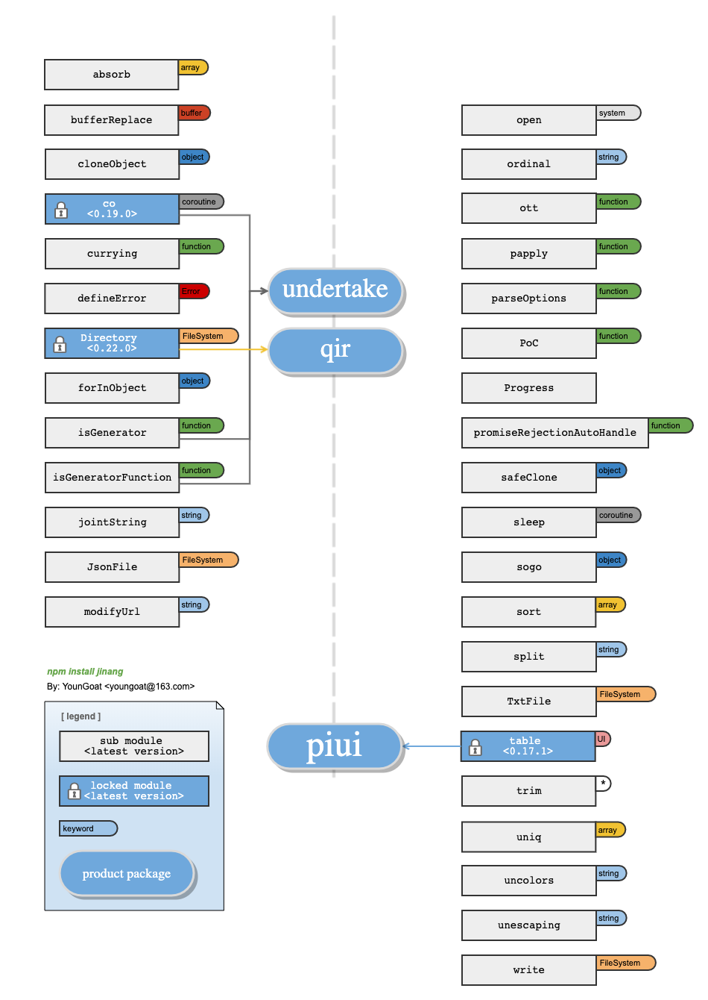

#	jinang
__Collection of Node.js / ECMAScript Mini Modules__

[](https://coveralls.io/github/YounGoat/jinang2?branch=master)
[](https://travis-ci.org/YounGoat/jinang)
[](https://www.npmjs.com/package/jinang)
[](https://www.npmjs.com/package/jinang)
[](https://www.npmjs.com/package/jinang)

>	Other Languages / 敬请等待 / 敬請等待  
>	If links in this document not avaiable, please access [README on GitHub](https://github.com/YounGoat/jinang/blob/master/README.md) directly.

##  Description

__jinang__ is a collection of Node.js / ECMAScript mini modules.

The name *jinang* is abbreviation of "Jin-Nang", which in Chinese means a magic box. The modules in __jinang__ are independent for each other, and are for different usage.

__jinang__ is an incubator. Successful sub modules may be encouraged to be published as independent NPM packages.

Here is its pedigree.  


##  Table of Contents

* [Get Started](#get-started)
* [API](#api)
* [Why *jinang*](#why-jinang)
* [The Incubated](#the-incubated)
* [Links](#links)

##	Get Started

```javascript
// Modules are independent for each other and are suggested to be required independently.
const defineError = require('jinang/defineError');

const MyError = defineError('MyError', Error, function(message) {
    this.code = 'SOMETHING_IS_WRONG';
    this.message = message;
});

// ...
throw new MyError('Helo word!');
```

##	API

All sub-modules in __jinang__ are independent from each other. Use `require('jinang/<subModuleName>')` to require the sub-modules.

For your convenience, avaiable modules included in *jinang* are listed here (alphabetically sorted):

*   [absorb](./docs/absorb.md) :
    Concatenate following array(s) to the firt one.
*   [cloneObject](./docs/cloneObject.md) :
    Copy some / all properties from object and return a new one.
*   [co](./docs/co.md) :
    A wrapper of generator function.
*   [currying](./docs/currying.md) :
    Make function curried.
*   [defineError](./docs/defineError.md) :
    Create customised Error class.
*   [Directory](./docs/Directory.md) :
    Make it easier to manage a directory.
*   [forInObject](./docs/forInObject.md) :
    The combination of [For...In](https://developer.mozilla.org/en-US/docs/Web/JavaScript/Reference/Statements/for...in) and [For...Of](https://developer.mozilla.org/en-US/docs/Web/JavaScript/Reference/Statements/for...of).
*   [isGenerator](./docs/isGenerator.md) :
    Judge whether it is a [Generator](https://developer.mozilla.org/en-US/docs/Web/JavaScript/Reference/Global_Objects/Generator).
*   [isGeneratorFunction](./docs/isGeneratorFunction.md) :
    Judge whether it is a [Generator Function](https://developer.mozilla.org/en-US/docs/Web/JavaScript/Reference/Statements/function*).
*   [jointString](./docs/jointString.md) :
    Concatenate strings with specified joint.
*   [JsonFile](./docs/JsonFile.md) :
    Wrapper of a JSON file.
*   [modifyUrl](./docs/modifyUrl.md) :
    Modify URLs.
*   [open](./docs/open.md) :
    Open URI with matched application.
*   [ordinal](./docs/ordinal.md) :
    Acquire the ordinal form of a natural number.
*   [ott](./docs/ott.md) :
    Wrap a function to allow it invoked only once, twice or thrice.
*   [papply](./docs/papply.md) :
    Partial application of a function.
*   [parseOptions](./docs/parseOptions.md) :
    Intelligently parse an option object.
*   [PoC](./docs/PoC.md) :
    Promise or Callback.
*   [Progress](./docs/Progress.md) :
    Progress simulator.
*   [promiseRejectionAutoHandle](./docs/promiseRejectionAutoHandle.md) :
    Avoid console warning when no cather defined.
*   [safeClone](./docs/safeClone.md) :
    A deep and partial clone method.
*   [sleep](./docs/sleep.md) :
    Make current process to "sleep" for a while.
*   [sogo](./docs/sogo.md) :
    To set something into object, or get something from object.
*   [sort](./docs/sort.md) :
    Sort an array.
*   [split](./docs/split.md) :
    Split string in different ways.
*   [table](./docs/table.md) :
    Create a printable table or print a table directly in console. 
*   [TxtFile](./docs/TxtFile.md) :
    Wrapper of a .txt file.
*   [unescaping](./docs/unescaping.md) :
    A tiny and flexible template render.
*   [write](./docs/write.md) :
    Write into a file. If file not exists, create it.

##  Why *jinang*

__jinang__ is an incubator for creatives which will make programming with Node.js much easier. 

Only mini modules without any dependencies may be put into __jinang__. Although every module is small enough, they all will be maintained carefully and seriously.

##  The Incubated

*   [piui](https://www.npmjs.com/package/piui)  
    from [table](./docs/table.md)
*   [undertake](https://www.npmjs.com/package/undertake)  
    from [co](./docs/co.md), [isGenerator](./docs/isGenerator.md) and [isGeneratorFunction](./docs/isGeneratorFunction.md)

##  Links

*	[CHANGE LOG](./CHANGELOG.md)
*	[Homepage](https://github.com/YounGoat/jinang)
