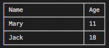

##	jinang/table

Create a printable table or print a table directly in console. 

```javascript
const table = require('jinang/table');

const rows = [
    { name: 'Mary', age: 11, },
    { name: 'Jack', age: 18, },
];
const columns = [
    { name: 'name', title: 'Name', size: 20 },
    { name: 'age', title: 'Age', },
];
table.print(rows, { columns });
```

The output in console may look like this:  



### API

*   string[] __table__( object[] *rows* )
*   string[] __table__( object[] *rows*, object *options* )
*   string[] __table.print__( object[] *rows* )
*   string[] __table.print__( object[] *rows*, object *options* )

Here *rows* is an array of plain objects containing data to fill table cells.

*options* used to modify style of the table:
```javascript
{
    columns: [ /* ColumnMeta[] OPTIONAL */
        {   /* ColumnMeta */
            name, /* string, corresponding key name of the column */
            size, /* number, column width */
            align, /* enum('left', 'center', 'right') DEFAULT 'left' */
        }
    ],
    displayHead, /* boolean DEFAULT true */
    border, /* enum('thin', 'none') DEFAULT 'thin' */
    indent, /* number DEFAULT 0 */
    padding, /* number DEFAULT 1 */
}
```

*   __size__, __indent__ and __padding__ are all numbers, representing horizontal length in characters.
*   __size__ is the length of cell contents with spaces included but padding excluded.